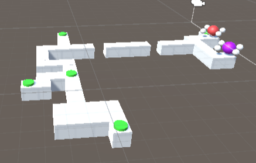
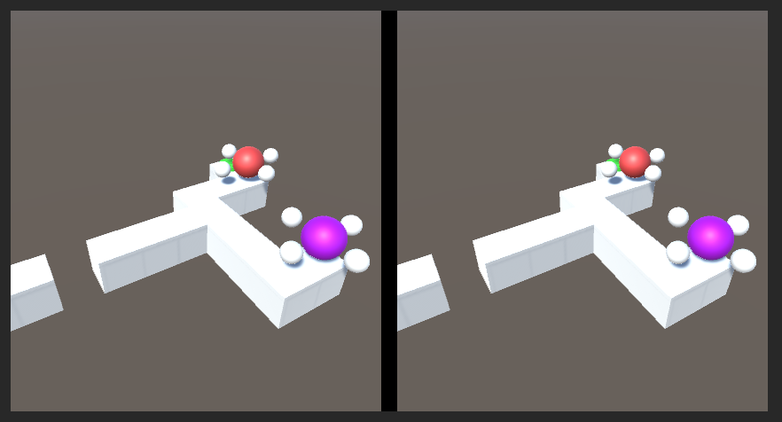

# Unity_CooperativeGamePuzzle

## About
This is a simple cooperative (co-op) puzzle game built with Unity and written in C#. There are two players and thye must help each other reach the end goal cooperatively.

There are two "players": a red ball and a purple ball. They are controlled with seperate controls and must navigate through a maze with obstacles and clever mechanisms to reach the end goal.

## 



## Controls
For the player that controls the red ball
```
To move up press: '↑'
To move down press: '↓'
To move left press: '←'
To move right press: '→'
```

For the player that controls the purple ball
```
To move up press: 'W'
To move down press: 'S'
To move left press: 'A'
To move right press: 'D'
```
## Installation
To run the game on your local machine, follow these steps:
```
1. Clone the repository or download the source code as a ZIP file.

2. Open Unity and navigate to the project folder.

3. Open the project in Unity by selecting the folder and clicking "Open."

4. Once the project is open, navigate to the "Scenes" folder and open the "Main" scene.

5. Connect a supported platform (such as your mobile device or Unity's Play Mode) to run the game.

6. Build and run the project.
```
